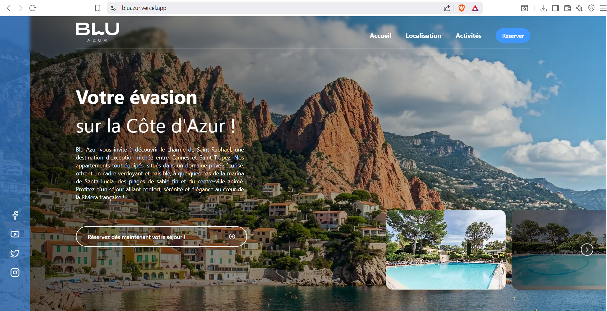
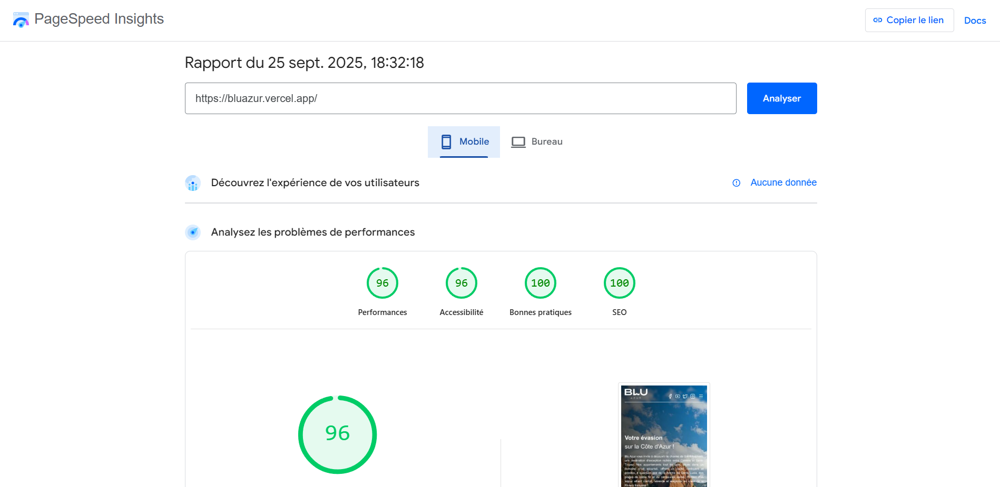

# 🌊 Blu Azur – Landing Page

Une landing page moderne et élégante développée à partir d’une maquette Figma fournie dans le cadre d’un test technique.  
L’objectif du projet est de transformer un design statique en une interface web performante, responsive et accessible.

---

## 🚀 Démo

👉 [Lien vers la démo déployée](https://bluazur.vercel.app/)  
👉 [Lien vers la maquette Figma](https://www.figma.com/design/U8x9G8gQAjQpVOoyWisaYg/Blu-Azur?node-id=7-5&t=eOflIcv2C7PCqqOz-0)

---

## 📸 Aperçu



---

## ⚡ Performance

Optimisé pour la vitesse et l’accessibilité :  



- **Performance :** 96
- **Accessibilité :** 96
- **Best Practices :** 100
- **SEO :** 100

---

## 🛠️ Technologies utilisées

- [Next.js 15](https://nextjs.org/) – Framework React pour le rendu côté serveur et le SEO
- [React 18](https://react.dev/) – Librairie UI
- [TypeScript](https://www.typescriptlang.org/) – Typage statique
- [Tailwind CSS v4](https://tailwindcss.com/) – Styles utilitaires rapides et modulaires
- [Shadcn/UI](https://ui.shadcn.com/) – Composants réutilisables accessibles
- [Lucide Icons](https://lucide.dev/) – Icônes modernes
- [ESLint + Prettier](https://eslint.org/) – Linting et formatage de code
- [npm](https://npm.io/) – Gestionnaire de paquets rapide et efficace

--- 

## 🧩 Structuration des composants

Le projet suit le **pattern Atomic Design** pour assurer une bonne lisibilité et réutilisabilité du code :  

```bash
src/
├── app/           # Pages Next.js (routes)
├── components/
│   ├── atoms/     # Boutons, titres, icônes...
│   ├── molecules/ # Combinaisons d’atoms
│   ├── organisms/ # Sections complètes
│   ├── templates/ # Disposition globale des pages
├── public/        # Images et assets statiques
├── styles/        # Styles globaux
└── hooks/         # Hooks personnalisés

```

## ⚙️ Installation et lancement du projet

### 1. Cloner le dépôt
```bash
git clone https://github.com/SafidyRamaroson/blu-azur.git
cd blu-azur
```

### 2. Installer les dépendances
```bash
npm install
```

### 3. Demarrer le serveur
```bash
npm run dev
```
Le projet sera accessible sur [http://localhost:3000](http://localhost:3000)  


